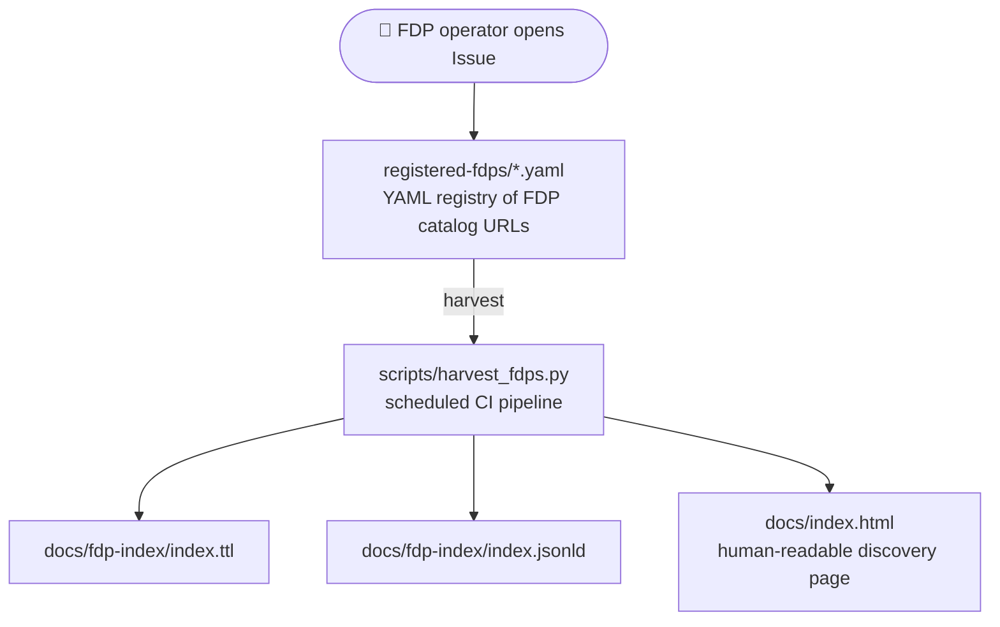

# staticfdp-index

A **Static FDP Index** — the second layer of the StaticFDP ecosystem
([GitHub](https://github.com/StaticFDP/staticfdp) · [Codeberg](https://codeberg.org/StaticFDP/staticfdp)).

An FDP Index is a registry of FAIR Data Points. FDPs register by opening a
GitHub Issue or submitting a YAML pull request. A CI pipeline periodically
harvests all registered FDPs, validates their catalogs, and rebuilds a
machine-readable DCAT index served as static RDF + an HTML discovery page.
No dedicated server required.

---

## Part of the StaticFDP Ecosystem

| Repository | GitHub | Codeberg | Layer |
|---|---|---|---|
| staticfdp | [github.com/StaticFDP/staticfdp](https://github.com/StaticFDP/staticfdp) | [codeberg.org/StaticFDP/staticfdp](https://codeberg.org/StaticFDP/staticfdp) | FAIR Data Point |
| **staticfdp-index** ← you are here | [github.com/StaticFDP/staticfdp-index](https://github.com/StaticFDP/staticfdp-index) | [codeberg.org/StaticFDP/staticfdp-index](https://codeberg.org/StaticFDP/staticfdp-index) | FDP Index |
| staticfdp-vp | [github.com/StaticFDP/staticfdp-vp](https://github.com/StaticFDP/staticfdp-vp) | [codeberg.org/StaticFDP/staticfdp-vp](https://codeberg.org/StaticFDP/staticfdp-vp) | Virtual Platform |

---

## How it works

1. **Register** — an FDP operator opens a GitHub Issue using the *Register FDP* template,
   providing their FDP's catalog URL
2. **Harvest** — a scheduled CI pipeline (`scripts/harvest_fdps.py`) fetches every
   registered catalog, validates it as DCAT, and extracts titles / descriptions
3. **Publish** — the pipeline writes `docs/fdp-index/index.ttl` (DCAT catalog of catalogs)
   and `docs/fdp-index/index.jsonld`, then commits and pushes; GitHub / Codeberg Pages
   serves the result immediately



---

## Quick start

**GitHub:**
```bash
git clone https://github.com/StaticFDP/staticfdp-index
cd staticfdp-index
bash scripts/setup.sh          # configure GitHub / Codeberg / both
```

**Codeberg:**
```bash
git clone https://codeberg.org/StaticFDP/staticfdp-index
cd staticfdp-index
bash scripts/setup.sh
```

Then:
1. Set secrets (`GITHUB_TOKEN` for GitHub Actions, `FORGEJO_TOKEN` for Woodpecker)
2. Enable GitHub Pages (branch `main`, path `/docs`)
3. Invite FDP operators to open *Register FDP* Issues

---

## Registering an FDP

Open an Issue using the **Register FDP** template and provide:
- FDP name
- Catalog URL (must resolve to valid Turtle containing a `dcat:Catalog`)
- Contact / maintainer

The harvest pipeline runs daily and on every new registration issue.

---

## Configuration (`fdp-index-config.yaml`)

```yaml
fdp_index:
  title: "My FDP Index"
  base_url: https://OWNER.github.io/staticfdp-index
  publisher_name: "My Organisation"
  publisher_url: https://example.org/

infrastructure:
  primary: github          # github | codeberg | both
  github:
    enabled: true
    repo: OWNER/staticfdp-index
    pages_url: https://OWNER.github.io/staticfdp-index
  codeberg:
    enabled: false
    repo: OWNER/staticfdp-index
    base_url: https://codeberg.org
    pages_url: https://OWNER.codeberg.page/staticfdp-index
```

---

## Secrets required

| Secret | Purpose |
|---|---|
| `GITHUB_TOKEN` | Commit generated files (GitHub Actions) |
| `FORGEJO_TOKEN` | Commit generated files (Woodpecker / Codeberg) |

---

## Authors

This work was envisioned and built by:

| Name | ORCID |
|---|---|
| Rajaram Kaliyaperumal | [](https://orcid.org/0000-0002-1215-167X) |
| Eric G. Prud'hommeaux | [](https://orcid.org/0000-0003-1775-9921) |
| Egon Willighagen | [](https://orcid.org/0000-0001-7542-0286) |
| Andra Waagmeester | [](https://orcid.org/0000-0001-9773-4008) |

Machine-readable citation metadata is available in [`CITATION.cff`](CITATION.cff) and [`codemeta.json`](codemeta.json).

---

## License

MIT.
